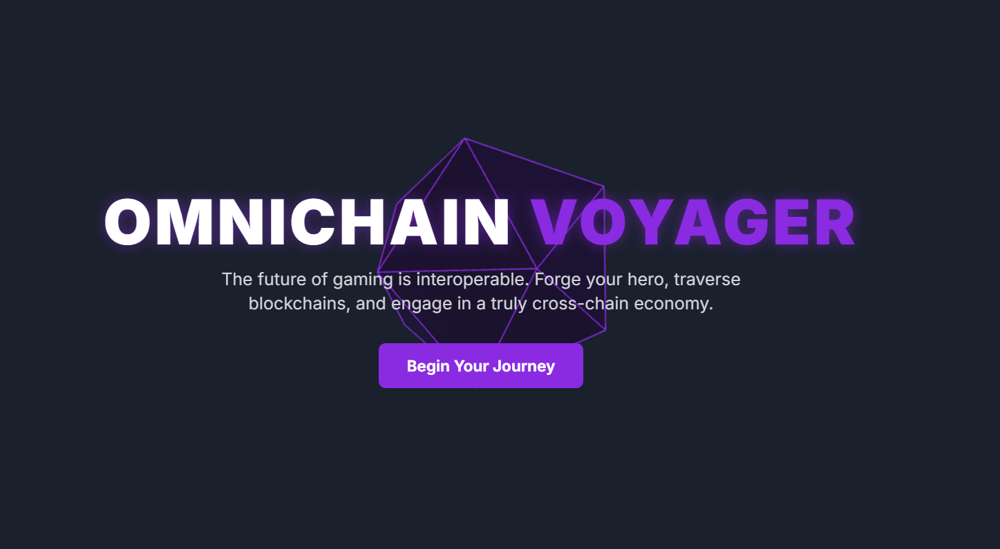

# 🌌 OmniChain Voyager

**The Future of Gaming is Omnichain**  
Forge your hero, traverse blockchains, and engage in a truly interoperable, cross-chain economy.

---



## 🔗 Live Demo  
🌐 [https://omnichain-voyager.vercel.app/](https://omnichain-voyager.vercel.app/)

## 🎥 Demo Video  
📹 [Watch on YouTube](https://youtu.be/5UGyrs2ix3w)  
🟣 [Also on CodeCup](https://codecup.cc/videos/YVZSpF54ksKPV0ny2pin) – a Web3 video platform where dev work becomes an on-chain asset.

💡 CodeCup is one of our projects:  
Upload technical demos, earn NFTs for your builds, and grow your Web3 dev identity on Solana.

## 🧾 Submission  
This project is a submission for the **LayerZero Solana Bounty** at the **Superteam Fun Hackathon**.

---

## ❌ The Problem: Trapped Assets, Fractured Worlds

Today, game characters, digital identities, and assets are stuck on single chains.  
A hero minted on Ethereum cannot easily venture into the fast, low-cost world of Solana.  
This blockchain isolation is the biggest barrier to immersive Web3 games and metaverse worlds.

---

## ✅ The Solution: A Blueprint for the Omnichain Economy

OmniChain Voyager is a working prototype that **breaks asset isolation**.  
With **LayerZero's omnichain messaging**, it enables characters to:

- Originate on Ethereum  
- Bridge to Solana for fast, low-cost gameplay  
- Return with all their progress (XP, stats, items) intact  

And we didn't stop there — we’ve also demonstrated **cross-chain social gifting**, showing how players can send items to friends on *any* chain.

---

## ✨ Core Features

- 🎭 **Character Personalization:** Name your Voyager and create a unique identity  
- 🌉 **Seamless Bridging:** Simulated bridge using LayerZero-style `send()` + `lzReceive()` logic  
- ⚔️ **Dynamic Quests:** Randomized story-based quests on Solana with XP + loot  
- 📈 **Meaningful Progression:** Strategic skill-point allocation (STR, DEF, AGI)  
- 🎁 **Social Gifting:** Cross-chain XP/item gifting (simulated LayerZero messaging)  
- 🔗 **Live TX Links:** Log console includes links to real [LayerZero Scan](https://layerzeroscan.com) transactions  
- 🏆 **Leaderboard & Social Sharing:** Share your Voyager on X and view rankings  
- 🌐 **Stunning 3D Homepage:** Interactive Three.js landing page for a premium feel  

---

## ⚙️ How It Works: Omnichain Logic Simulation

OmniChain Voyager simulates the logic of a real **LayerZero OApp**:

1. **`send()` from Ethereum:**  
   Simulates sending NFT data (ID, level, stats) via LayerZero to Solana.  
   Includes gas estimation and log visualization.

2. **LayerZero Messaging:**  
   A delay mimics oracle + relayer message flow.  
   Logs show validation and dispatch across chains.

3. **`lzReceive()` on Solana:**  
   Data arrives, character state is updated, quests become available.  
   New XP and stats are tracked and applied.

4. **Return Journey:**  
   The upgraded NFT returns to Ethereum — progress is synced.

---

## 🛠️ Tech Stack

| Component        | Stack                         |
|------------------|-------------------------------|
| Frontend         | React + Next.js               |
| 3D Experience    | Three.js                      |
| Styling          | Tailwind CSS                  |
| Cross-Chain Infra| LayerZero (ONFT Simulation)   |
| Deployment       | Vercel                        |

---

## 🧪 Run Locally

```bash
git clone https://github.com/iamaanahmad/omnichain-voyager.git
cd omnichain-voyager
npm install
npm run dev
```

Then visit: `http://localhost:3000`

---

## 👨‍🚀 Created By  
**Amaan Ahmad** — Solo Developer  
Built in 3 Days for the Superteam x LayerZero Hackathon 🚀
